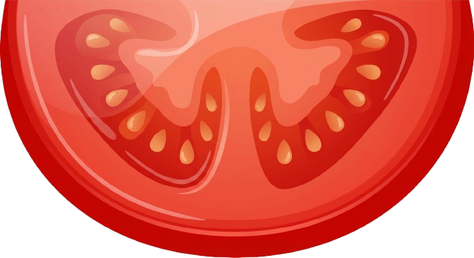
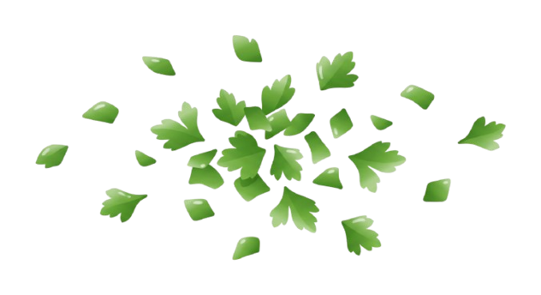
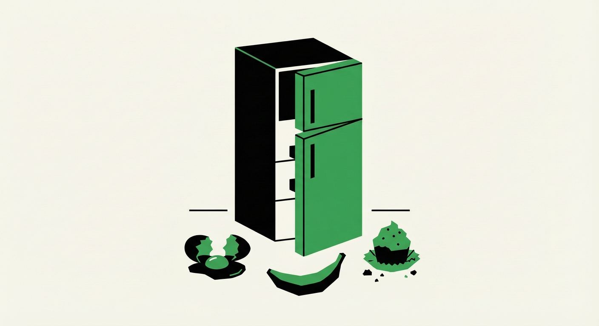

### AI used:

- Vercel (v0):
  - Prototyped the UI at the start; this was the original design before major changes: [original UI](documented_files/dummy_recipe.html)

- ChatGPT:
  - General lazy tasks such as:
    - Look at this JSON file. Could you create more ingredients and recipes, mirroring the ones we already have?
    - I renamed my URLs to all take pk instead of recipe_id, id and so on. Could you read these views and let me know if I failed to update to pk anywhere?
    

- Claude:
  - explained to me how ajax works and showed me how to apply it to my views 
  - Assisted me with questions, such as "Do you think solution X is optimal, or should I do Y. What are the pros and cons of both approaches"
  - Some CSS suggestions
  

- ClickUp Brain:
  - Generated images:

    
    
    
    
    

  
  
### Other tools used:

- https://www.canva.com/
- https://www.remove.bg/
- https://boxy-svg.com/
- https://www.stickerit.co/tools/vectoriser
- https://svgcrop.com/
- https://vectorizer.com/
- https://prismic.io/blog/css-text-animations
- https://www.svgrepo.com/vectors/
- https://cloudconvert.com/png-to-ico
- https://www.figma.com/
- https://uiverse.io/mRcOol7/hot-fox-27
- https://fonts.google.com/
- https://favicon.io/favicon-generator/

